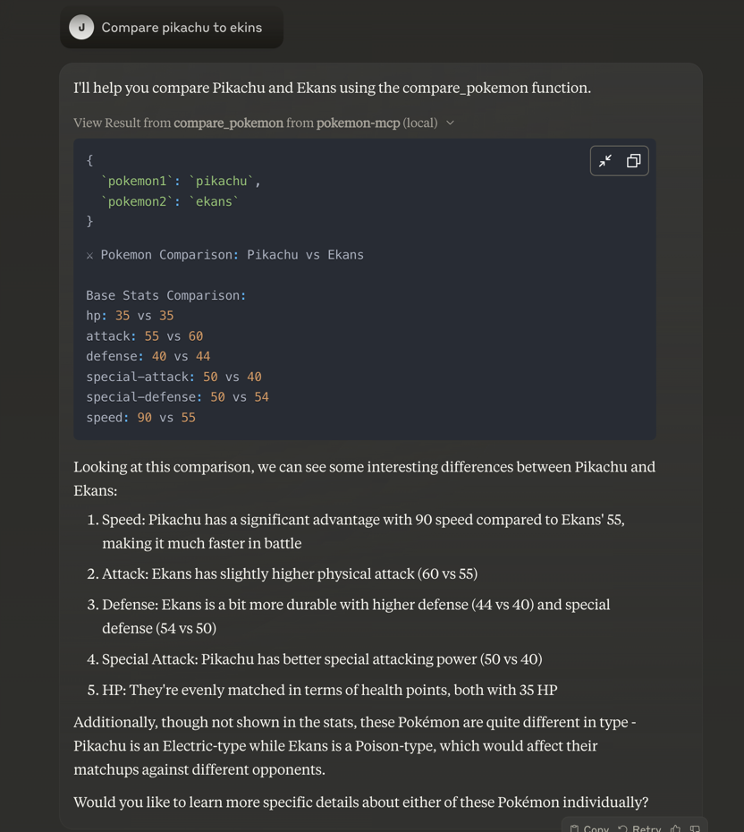

# Pokemon MCP Integration Guide

## Overview
This guide demonstrates how to integrate Pokemon API functionality into Claude using the Model Context Protocol (MCP). The implementation serves as a proof of concept for MCP methodologies, showcasing how easily external APIs can be integrated with Claude.

## Implementation Details
The integration is built in Go, leveraging its robust built-in networking capabilities. The resulting binary acts as a bridge between Claude and the Pokemon API.

## Installation Steps

1. **Compile the Binary**
    - Build the Go application to create the MCP server binary
    - Store the binary in a location that will be referenced by your Claude desktop configuration

2. **Configure Claude Desktop**
   Add the MCP server configuration to your Claude desktop config file (`claude_desktop_config.json`):

   ```json
   {
       "mcpServers": {
           "pokemon-mcp": {
               "command": "/tmp/pokemon-mcp"
           }
       }
   }
   ```

## Further Resources
For more detailed information about MCP integration, refer to the [MCP Quick Start Guide](https://modelcontextprotocol.io/quickstart)

## Notes
- The binary location (`/tmp/pokemon-mcp`) should be adjusted according to your system setup
- Ensure the binary has appropriate execution permissions
- The MCP server name (`pokemon-mcp`) can be customized as needed


# Results

